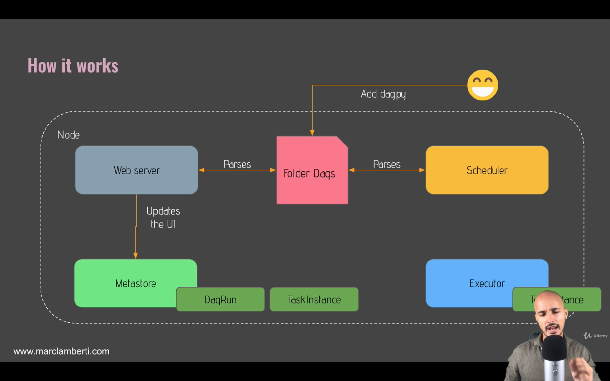

# How does Airflow work?

**One node architecture** - Working on a single machine.

As before, we have the same components running inside the same machine:

* Web Server
* Scheduler
* Metastore
* Executor (A 'Queue inside here, defining the order in which these tasks will be executed).

**Multi node architecture** - Working across multiple machines.

Node 1:

* Web Server, Scheduler, Executor, Workers.

Node 2:

* Metastore, Queue (now external from the Executor), Workers.

### An example.

Attached below is a H-L overview of an example using single node architecture, we will go through this in more detail later in the course & using concrete examples.

