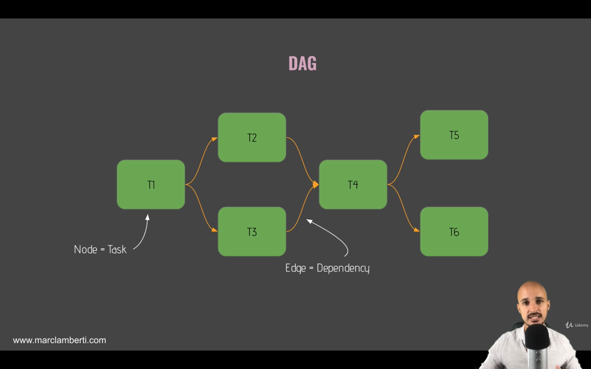

# What is a DAG?

We learnt before that a DAG is a directed acyclic graph. But what does this mean specifically?

In more common terms, **a DAG is a data pipeline**.

Below is a simple example of what a DAG may look like, remember, tasks are completed on each node in the order that they're coded. Thus, once our scheduler is triggered to run this DAG, node T1 will complete it's task, before going onto node T2 to complete it's task etc.

