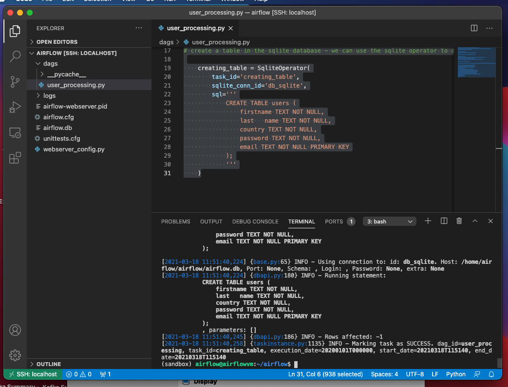
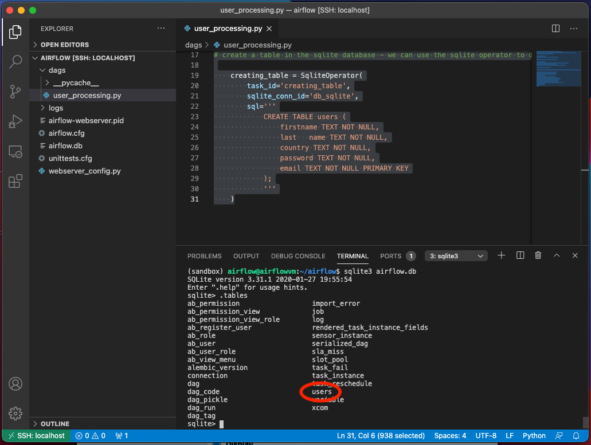

# Testing a new task.

Each time we add a new task to our data pipeline, we need to make sure that we can test it.

To do this, we can use the Airflow CLI:

```airflow tasks test <dag_id> <task_id> <execution_date>``` - so in our case for the user_processing DAG...

```airflow tasks test user_processing creating_table 2020-01-01``` - providing everything was configured correctly, should give us the following output...



And now using the SQLite operator and the CLI command:
```
sqlite3 airflow.db
```

We can check to see whether our 'users' table has been created...

