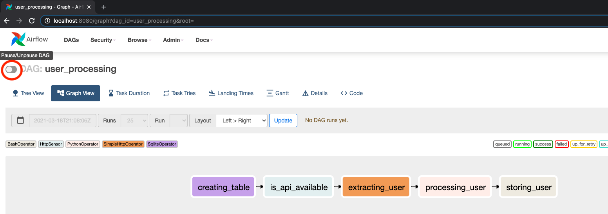
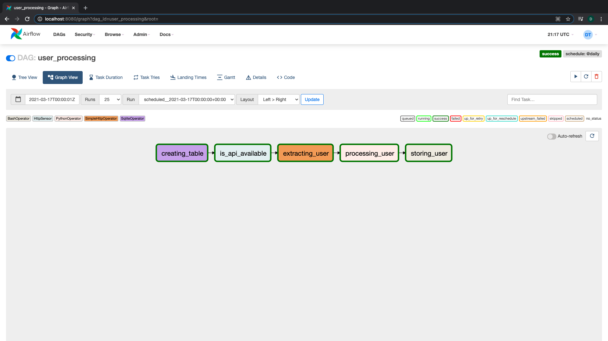

# Running the DAG.

Let's run the DAG using the Airflow UI.

Click on the DAG you want to run & toggle the button in the top-left:

Then refresh the page.

If a task fails, or you get an error, make changes to the script and rerun.

**Important:** Remember to identify the task that has failed and clear it's current progress before rerunning. Do this by clicking on the failed task and clicking 'Clear'.

Here, our DAG run was successful and each task ran successfully.

